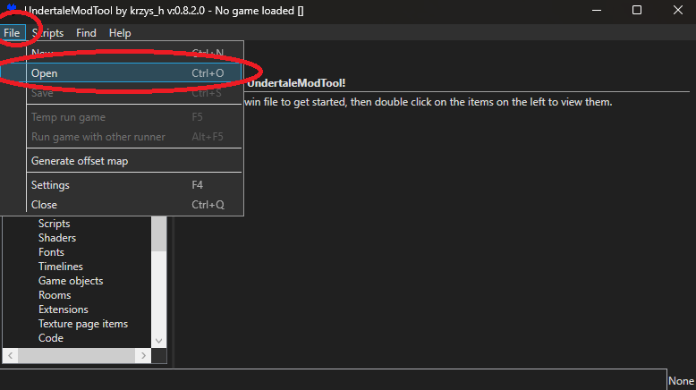
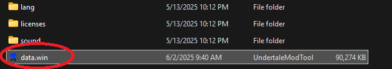
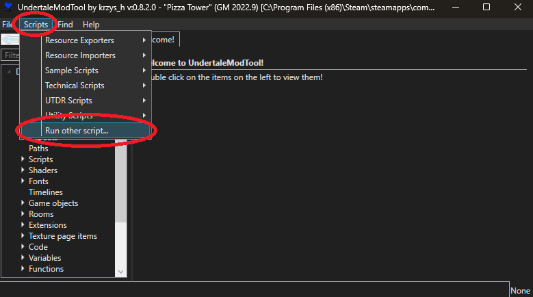
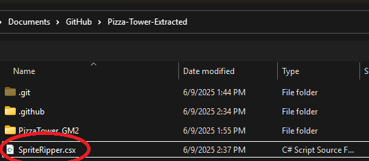
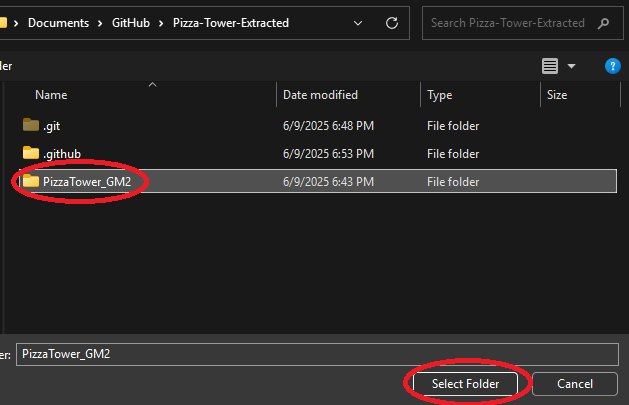

# Pizza Tower EXtracted
A semi-accurate decompilation of Pizza Tower

# Dependencies
- [Pizza Tower release data file](https://store.steampowered.com/app/2231450/Pizza_Tower/)
- [UndertaleModTool](https://github.com/UnderminersTeam/UndertaleModTool/releases/tag/0.8.2.0)
- [GameMaker LTS IDE Version 2022.0.1.31](https://gms.yoyogames.com/GameMaker-Installer-2022.0.1.31.exe)
- [GameMaker Runtime Version 2022.0.1.30](https://drive.google.com/file/d/1NGlNwAVUgff5biokP7SW8mbp4lYafb6e/view?usp=sharing)
# How To Install

  
<h2>IDE Setup</h2>

  1. Install the [GameMaker LTS IDE Version 2022.0.1.31](https://gms.yoyogames.com/GameMaker-Installer-2022.0.1.31.exe).
  2. Attempt to install LTS runtime 2022.1.30.

  

    
<h2>If the runtime failed to install</h2>

  As of 6/9/2025, Runtime version 2022.0.1.30 is unable to download from yoyogames, this is why I have included a download link for it.
  1. Install [GameMaker Runtime Version 2022.0.1.30](https://drive.google.com/file/d/1NGlNwAVUgff5biokP7SW8mbp4lYafb6e/view?usp=sharing).
  2. close GameMaker LTS 
  3. go to `C:\ProgramData\GameMakerStudio2-LTS\Cache\runtimes` and extract the runtime. (the extracted location must match this file path: `C:\ProgramData\GameMakerStudio2-LTS\Cache\runtimes\runtime-2022.0.1.30\receipt.json`)
  

  
<h2>Project setup</h2>

  Due to Pizza Tower costing money, I have created a script which should prevent anybody from compiling and playing this build.

  1. Download the 0.8.2.0 release build for [UndertaleModTool](https://github.com/UnderminersTeam/UndertaleModTool/releases/tag/0.8.2.0).

  2. Open the data.win file for Pizza Tower.

  

  

  3. Press the `Run other script...` button.

  

  4. Run `SpriteRipper.csx`, this will rip the sprites from the data.win file and add them to the GameMaker project.

  

  5. Select the `PizzaTower_GM2` project folder.

  

# Find an issue or innacuracy?

Please [report](https://github.com/crystallizedsparkle/Pizza-Tower-EXtracted/issues/new/choose) it!